<h1 align="center">🏥 LAYANAN KESEHATAN DIGITAL</h1>

---

## TENTANG

**Layanan Kesehatan Digital** adalah sistem manajemen layanan kesehatan modern berbasis web yang dirancang untuk membantu pengguna melakukan booking konsultasi dokter, mengelola jadwal praktik, dan mengakses informasi kesehatan secara efisien.

Sistem ini menyediakan:

- **Aplikasi Web** dengan landing page informatif, sistem registrasi & login, serta panel dashboard untuk pengelolaan layanan kesehatan.
- **Fitur Lengkap** untuk mencari dokter berdasarkan spesialisasi, melakukan booking konsultasi, melihat riwayat booking, serta mengelola artikel kesehatan dan laporan dalam format PDF.

Proyek ini bertujuan untuk mendigitalkan proses layanan kesehatan agar lebih mudah, terstruktur, dan dapat diakses kapan saja.

---

## 🚀 CARA PENGGUNAAN

1. **Akses Aplikasi** - Buka browser dan kunjungi `ardeliaweb.my.id`
2. **Daftar Akun** - Klik "Daftar" untuk membuat akun baru sebagai pasien
3. **Masuk** - Login menggunakan email dan password yang sudah terdaftar
4. **Booking Dokter** - Pilih dokter, tentukan jadwal, dan konfirmasi booking layanan kesehatan

---

## 🔐 AKUN DEMO

| Role | Email | Password |
|------|-------|----------|
| Admin | `admin@admin.com` | `admin123` |
| User | `ardelialuthfiani08@gmail.com` | `Adel11` |

---

## FITUR WEBSITE LAYANAN KESEHATAN DIGITAL
## FITUR PENGGUNA (USER)

| No | Fitur | Deskripsi |
|----|-------|-----------|
| 1 | **Registrasi** | Mendaftar akun baru dengan nama, email, no HP, dan password |
| 2 | **Login** | Masuk ke sistem menggunakan email dan password |
| 3 | **Dashboard** | Menampilkan ringkasan booking aktif, riwayat, dan artikel terbaru |
| 4 | **Cari Dokter** | Mencari dokter berdasarkan nama atau spesialisasi |
| 5 | **Detail Dokter** | Melihat profil dokter, tarif, dan jadwal praktik |
| 6 | **Booking** | Membuat janji konsultasi dengan memilih jadwal dan mengisi keluhan |
| 7 | **Riwayat Booking** | Melihat semua riwayat booking beserta statusnya |
| 8 | **Edit Profil** | Mengubah data pribadi (nama, email, no HP) |
| 9 | **Logout** | Keluar dari sistem |

---

## FITUR ADMINISTRATOR (ADMIN)

| No | Fitur | Deskripsi |
|----|-------|-----------|
| 1 | **Dashboard** | Melihat statistik total booking, pasien, dokter, dan artikel |
| 2 | **Kelola Booking** | Mengubah status booking (Pending/Confirmed/Done/Cancelled) |
| 3 | **Kelola Pasien** | Melihat daftar pasien yang terdaftar |
| 4 | **Kelola Dokter** | Tambah, edit, hapus data dokter |
| 5 | **Kelola Jadwal** | Tambah, edit, hapus jadwal praktik dokter |
| 6 | **Kelola Artikel** | Tambah, edit, hapus artikel kesehatan |
| 7 | **Laporan** | Export laporan booking ke format PDF |


---

## SCREENSHOT

### Landing Page
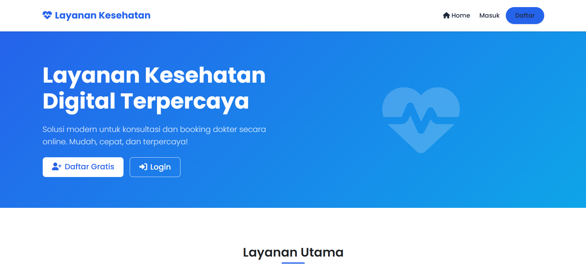
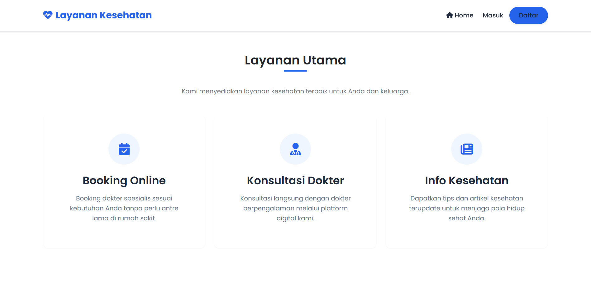
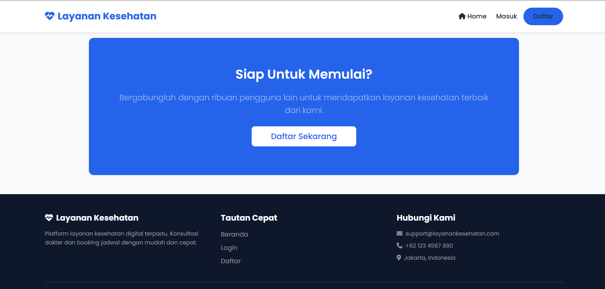

### Halaman Regist
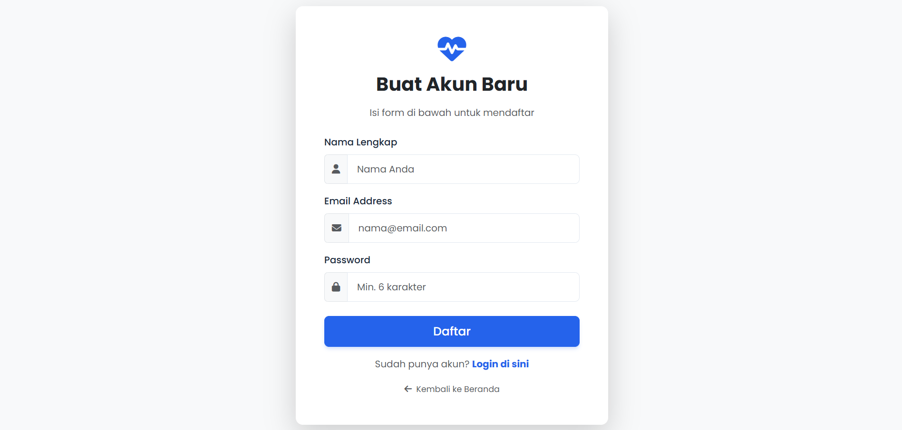

### Halaman Login
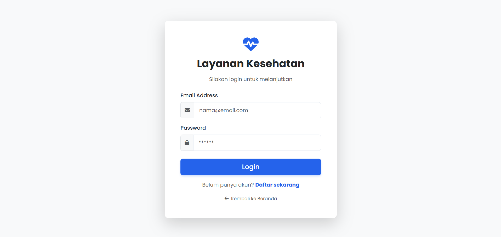

## A. USER

### Dashboard User
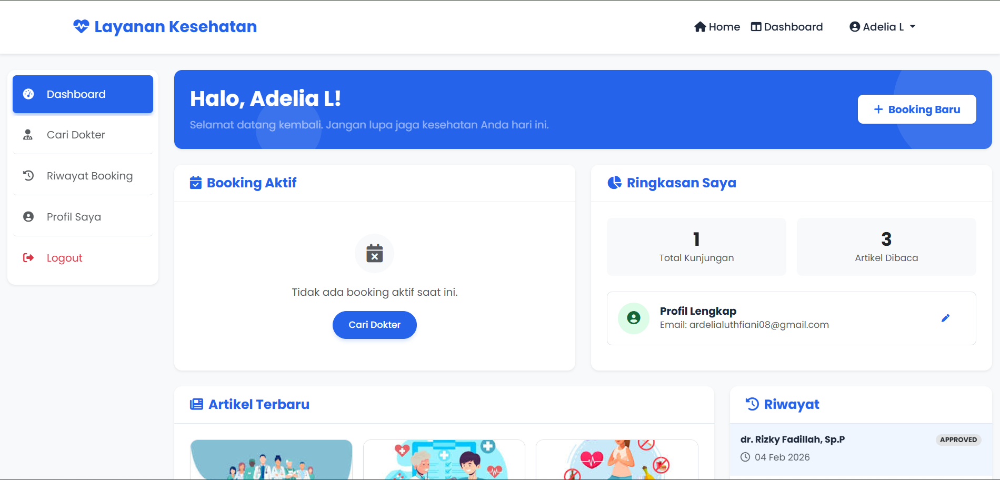
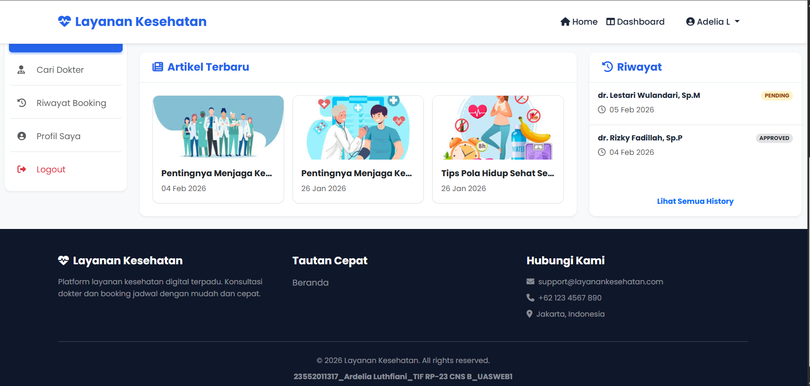

### Cari Dokter
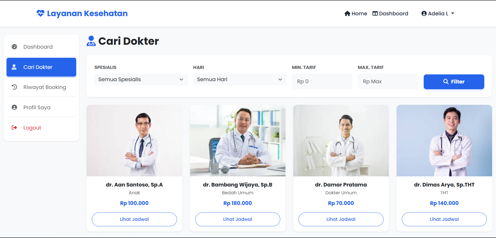

### Riwayat Booking
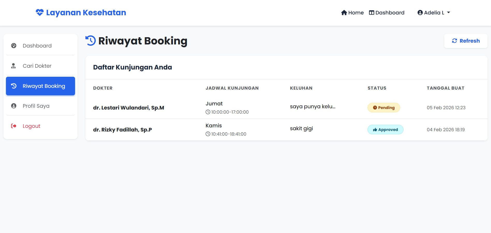

### Profile
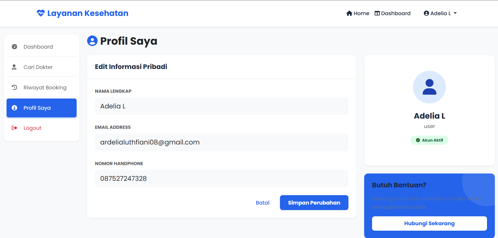

## B. ADMIN

### Dashboard Admin
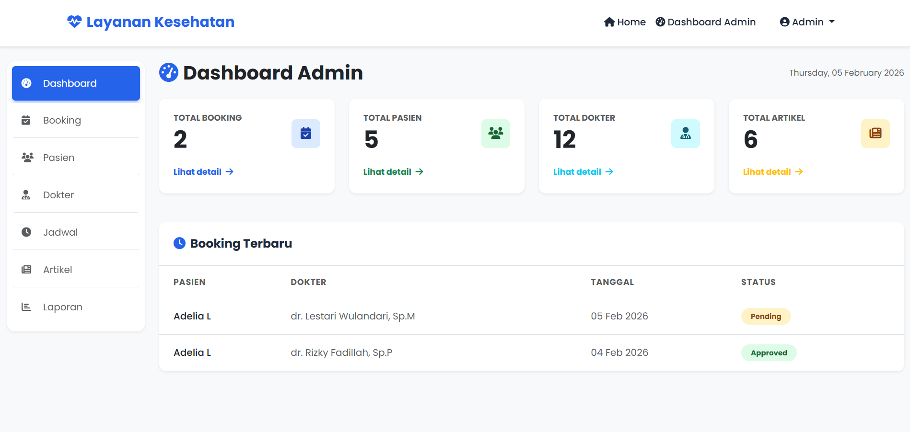

### Manajemen Booking
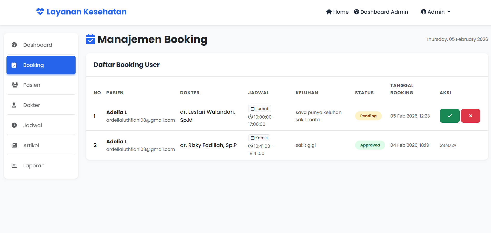

### Manajemen Pasien
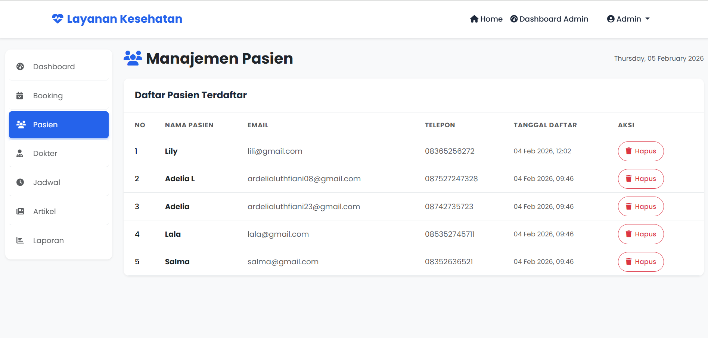

### Manajemen Dokter
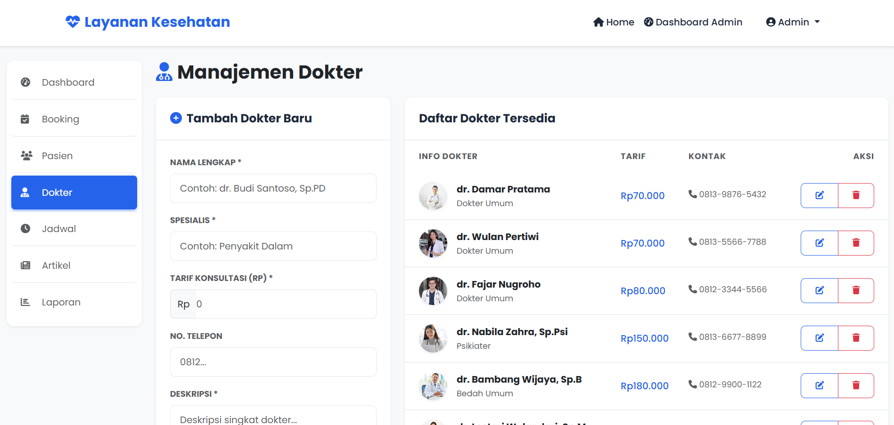

### Manajemen Jadwal
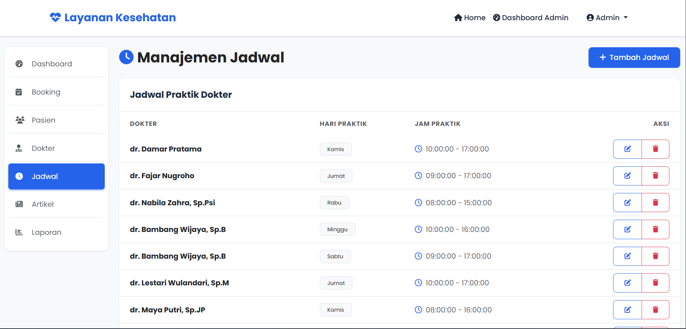

### Manajemen Artikel
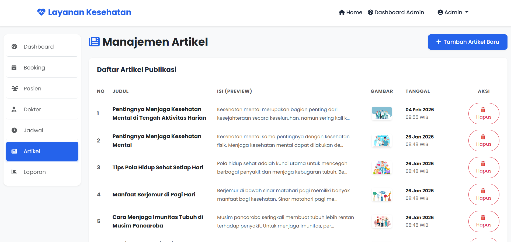

### Laporan dan Statistik
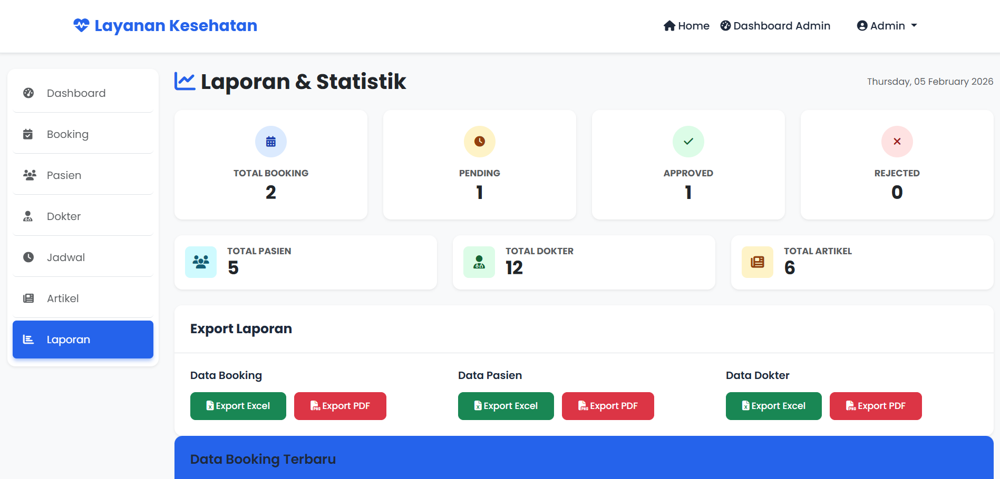

---

## 🎬 VIDEO DEMO WEBSITE

<p align="center">
  <a href="https://www.youtube.com/watch?v=qJ27YLBBHVg">
    
  </a>
</p>

<p align="center">
  <em>Klik gambar di atas untuk menonton video demo</em>
</p>

---

## TECH STACK

### Backend

| Komponen | Teknologi |
|----------|-----------|
| Bahasa | PHP 7.4+ |
| Framework | Native MVC Architecture |
| Database | MySQL/MariaDB |
| Autentikasi | Session-based |
| PDF Generator | mPDF Library |

### Frontend

| Komponen | Teknologi |
|----------|-----------|
| Markup | HTML5 |
| Styling | CSS3, Bootstrap 5 |
| JavaScript | Vanilla JavaScript |
| Icon | Font Awesome 6 |
| Responsive | Mobile-friendly Design |

---

## 📁 STRUKTUR PROJECT

```
layanan_kesehatan/
├── assets/                     # Static files (CSS, JS, Images)
│   ├── css/
│   │   ├── admin.css           # Admin panel styles
│   │   ├── bootstrap.min.css   # Bootstrap framework
│   │   ├── homepage.css        # Landing page styles
│   │   └── modern-theme.css    # User dashboard theme
│   ├── images/                 # Image assets
│   ├── js/
│   │   ├── bootstrap.bundle.min.js
│   │   └── session-manager.js  # Session handling
│   └── tcpdf/
│       └── mpdf/               # PDF generation library
│
├── config/                     # Configuration files
│   ├── db.php                  # Database connection
│   └── session_config.php      # Session settings
│
├── controllers/                # Business logic
│   ├── ArticleController.php   # Article CRUD
│   ├── AuthController.php      # Authentication
│   ├── BookingController.php   # Booking management
│   ├── DoctorController.php    # Doctor management
│   ├── ReportController.php    # Reports & exports
│   └── ScheduleController.php  # Schedule management
│
├── models/                     # Data models
│   ├── Article.php             # Article model
│   ├── Booking.php             # Booking model
│   ├── Doctor.php              # Doctor model
│   ├── Schedule.php            # Schedule model
│   └── User.php                # User model
│
├── views/                      # Frontend templates
│   ├── admin/                  # Admin pages
│   │   ├── articles.php        # Manage articles
│   │   ├── bookings.php        # Manage bookings
│   │   ├── dashboard.php       # Admin dashboard
│   │   ├── doctors.php         # Manage doctors
│   │   ├── patients.php        # Manage patients
│   │   ├── reports.php         # View reports
│   │   └── schedules.php       # Manage schedules
│   │
│   ├── auth/                   # Authentication pages
│   │   ├── login.php           # Login page
│   │   └── register.php        # Registration page
│   │
│   ├── layouts/                # Reusable components
│   │   ├── footer.php          # Global footer
│   │   └── header.php          # Global header
│   │
│   └── user/                   # User pages
│       ├── article_detail.php  # Article detail view
│       ├── booking_history.php # Booking history
│       ├── booking.php         # Make booking
│       ├── dashboard.php       # User dashboard
│       ├── doctor_detail.php   # Doctor profile
│       ├── doctors.php         # Doctor list
│       └── profile.php         # User profile
│
├── exports/                    # PDF export output
├── sessions/                   # Session storage
│
├── index.php                   # Entry point / Landing page
├── database.sql                # Database schema
└── README.md                   # Documentation
```

## MULAI SEKARANG

1. **Akses Aplikasi** - Buka browser dan kunjungi `ardeliaweb.my.id`
2. **Daftar Akun** - Klik "Daftar" untuk membuat akun baru sebagai pasien
3. **Masuk** - Login menggunakan email dan password yang sudah terdaftar
4. **Booking Dokter** - Pilih dokter, tentukan jadwal, dan konfirmasi booking layanan kesehatan

---

##  DEVELOPER

| | |
|--------------|--------------------------------|
| **NPM** | 23552011317 |
| **Nama** | Ardelia Luthfiani |
| **Kelas** | TIF RP 23 CNS-B |
| **Mata Kuliah** | Pemrograman Web I (UAS) |

